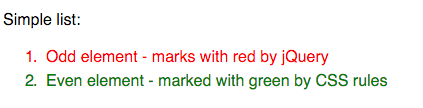

# test-jquery-filters-even-odd

:ledger: Test project explains difference in filters even/odd in jQuery and CSS selectors.

## Demo 🎉

https://piecioshka.github.io/test-jquery-filters-even-odd/src/

## Mistake

jQuery starts counting form 0 in each lists, so first item on list is 0.

 * This number is divided by 0, so **first element is even**.
 * Second item has index equal 1. It is not divided by 2, so **second element is odd**.

CSS starts counting from 1, so first item on list has index equals 1.

 * Number 1 is not divided by 2, so **first element is odd**. 
 * Second element has index equals 2. Of course is divided by 2, so **second element is even**.

